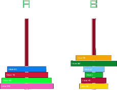

<p align="center">
  
</p>

# Push Swap

## Project Description

"Push Swap" is a project at the 42 Coding School, where the goal is to write an algorithm to sort an unsorted list of numbers. The algorithm uses two stacks and a limited number of **commands**. The aim is to sort the list with as few commands as possible. The learning objectives include getting to know and selecting an efficient sorting algorithm, as well as optimizing algorithms to solve specific problems concerning their runtime and memory usage [Big O Notation](https://en.wikipedia.org/wiki/Big_O_notation).

### Commands

The possible commands are:
- `sa` (swap a): Swaps the first two elements of stack a.
- `sb` (swap b): Swaps the first two elements of stack b.
- `ss` (swap both): Performs `sa` and `sb` simultaneously.
- `pa` (push a): Takes the top element from stack b and puts it on stack a.
- `pb` (push b): Takes the top element from stack a and puts it on stack b.
- `ra` (rotate a): Shifts all elements of stack a up by one position.
- `rb` (rotate b): Shifts all elements of stack b up by one position.
- `rr` (rotate both): Performs `ra` and `rb` simultaneously.
- `rra` (reverse rotate a): Shifts all elements of stack a down by one position.
- `rrb` (reverse rotate b): Shifts all elements of stack b down by one position.
- `rrr` (reverse rotate both): Performs `rra` and `rrb` simultaneously.

  (Look)[doc/Rules_view.md]

## Installation

1. **Clone the repository:**
   ```bash
   git clone https://github.com/ELREKO/push_swap.git
   cd push_swap
   ```

2. **Compile the program:**
   ```bash
   make
   ```

3. **clean**
	```bash
	make fclean
	make clean
	```

## Usage

### push_swap

To use the `push_swap` program, run the following command:

```bash
./push_swap [list of numbers]
```

Example:
```bash
./push_swap 4 67 3 87 23
```
or
```bash
ARG="4 67 3 87 23"; ./push_swap $ARG
```

## Tests

You can test the program with various inputs to ensure it works correctly. It is best to use scripts for automated testing.

Test: 
```bash
ARG="4 67 3 87 23"; ./push_swap $ARG | ./checker_OS $ARG
```
Replace `checker_OS` with the appropriate version for your operating system.

Example for Linux:
```bash
ARG="4 67 3 87 23"; ./push_swap $ARG | ./checker_linux $ARG
```

---
<p align="center">
  
</p>


