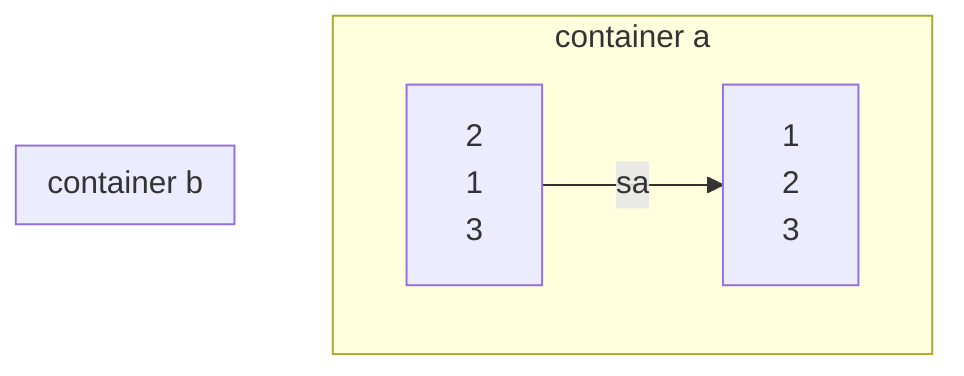
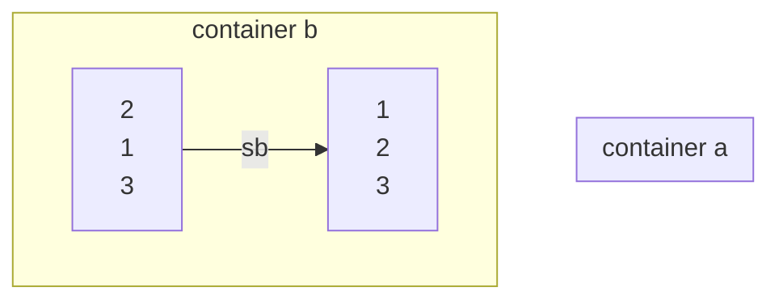
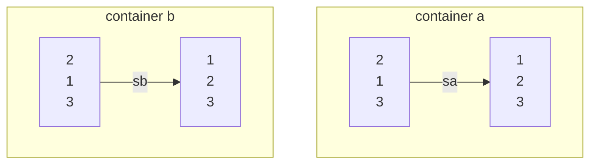
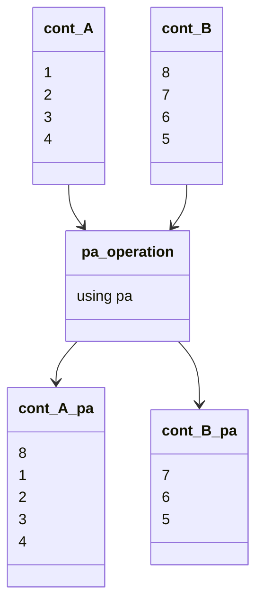
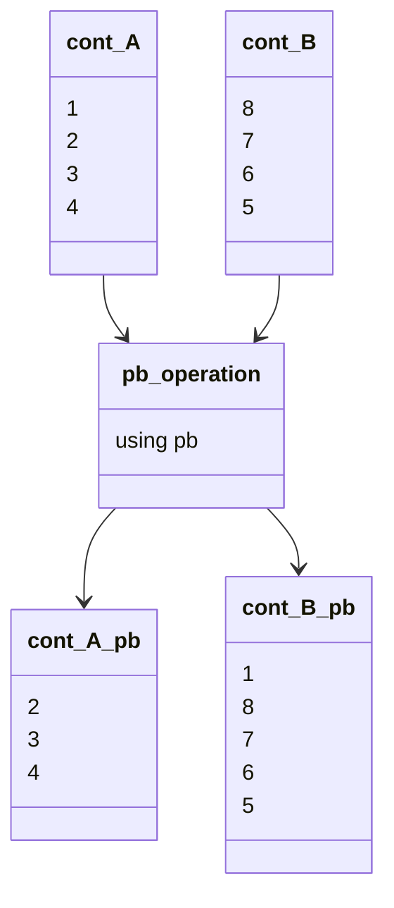
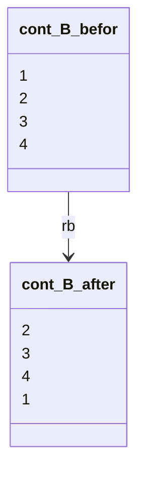
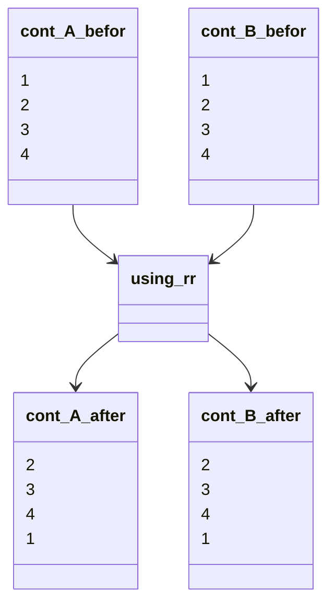

# Rules 
## swap container 
### comand sa
swap the first top elements of the container **A** 

### comand sb
swap the first top elements of the container **B** 

### comand ss
sa and sb together 

### comand pa 
push the top element from Container B to A

### comand pb  
push the top element from Container A to B

### comand ra 
rotating first segment to end, second to first, ... , from conainer A

###  comand rb 
rotating first segment to end, second to first, ... from container B

### comands rr
the operation **ra** and **rb** together

### comands , rra , rrb , rrr 
same like ra, rb, rr only rotating reverse
